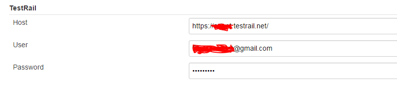
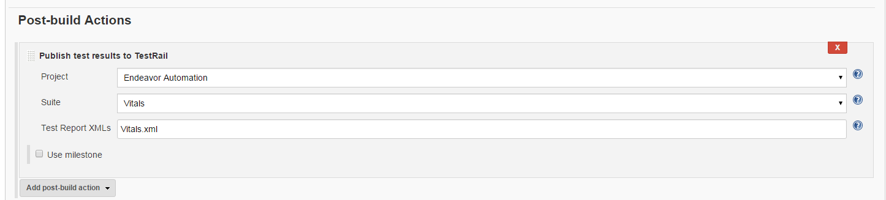

testrail-jenkins-plugin
=======================

Forked from  <https://github.com/achikin/testrail-jenkins-plugin>
Integrate test results from Jenkins into TestRail.
Upload your junit test results to TestRail after every run.
The file should follow the [junit schema](https://github.com/windyroad/JUnit-Schema/blob/master/JUnit.xsd)
Each Jenkins build becomes a test run.
Each test suite becomes a test group.

Using the Plugin
-----

1. This plugin is not yet available through Plugin Manager. It must be installed manually. Download the source and use the below command, which will create the hpi file (found in `/testrail-plugin/target`), which you can then upload to your Jenkins installation.

  ```bash
  mvn package
  ```

2. Once you install the plugin, you must configure the TestRail user in your Global Settings.


3. Go to the job you wish to use the plugin with and add a Post Build Acion. The option you want is Notify TestRail.

4. Configure the step. The Project and Test Suite dropdowns are automatically populated using the TestRail API.
Note you can also optionally define a Milestone that you are testing against.
The Test Report XMLs is a comma separated list of XML files in the job workspace containing results to send to TestRail.


Pipeline Support
-----

To use this plugin in a pipeline, add the following to your jenkinsfile:

```java
testRail(testrailProject: <Project ID>, testrailSuite: <Suite ID>,
         junitResultsGlob: '<Junit results>', createNewTestcases:<true | false>])
```

Developers

-----
This is a Maven project. You'll need the following in your ~/.m2/settings.xml. As an alternative, the settings file from the repo can be used directly, with `mvn --setings settings.xml ...`

```xml
<settings>
  <pluginGroups>
    <pluginGroup>org.jenkins-ci.tools</pluginGroup>
  </pluginGroups>

  <profiles>
    <!-- Give access to Jenkins plugins -->
    <profile>
      <id>jenkins</id>
      <activation>
        <activeByDefault>true</activeByDefault> <!-- change this to false, if you don't like to have it on per default -->
      </activation>
      <repositories>
        <repository>
          <id>repo.jenkins-ci.org</id>
          <url>https://repo.jenkins-ci.org/public/</url>
        </repository>
      </repositories>
      <pluginRepositories>
        <pluginRepository>
          <id>repo.jenkins-ci.org</id>
          <url>https://repo.jenkins-ci.org/public/</url>
        </pluginRepository>
      </pluginRepositories>
    </profile>
  </profiles>
  <mirrors>
    <mirror>
      <id>repo.jenkins-ci.org</id>
      <url>https://repo.jenkins-ci.org/public/</url>
      <mirrorOf>m.g.o-public</mirrorOf>
    </mirror>
  </mirrors>
</settings>
```

To run on your development box you can just do

```bash
mvn hpi:run
```

That will build and start a Jenkins instance running at <http://localhost:8080/jenkins>. It will have the plugin installed but not configured.
And to build a package to install on your production Jenkins box

```bash
mvn clean package
```

That creates a .hpi file in the target directory. For more information about installing plugins, please see <https://wiki.jenkins-ci.org/display/JENKINS/Plugins>.

License
-------

Licensed to the Apache Software Foundation (ASF) under one
or more contributor license agreements.  See the NOTICE file
distributed with this work for additional information
regarding copyright ownership.  The ASF licenses this file
to you under the Apache License, Version 2.0 (the
"License"); you may not use this file except in compliance
with the License.  You may obtain a copy of the License at: <http://www.apache.org/licenses/LICENSE-2.0>

Unless required by applicable law or agreed to in writing, software
distributed under the License is distributed on an "AS IS" BASIS,
WITHOUT WARRANTIES OR CONDITIONS OF ANY KIND, either express or implied.
See the License for the specific language governing permissions and
limitations under the License.
